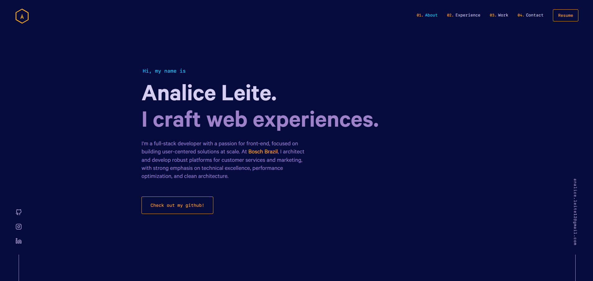

<div align="center">
  
</div>
<h1 align="center">
  Analice Leite - Portfolio
</h1>



## 👋 Welcome!

My personal portfolio built with **Gatsby** and **React**. Here you'll find my projects, work experience, and a bit more about me as a developer.

📱 **Visit:** [analice-dev.vercel.app](https://analice-dev.vercel.app)

---

## 💡 About This Project

This portfolio was built based on the design and code structure of **[Brittany Chiang](https://brittanychiang.com)**. I'm grateful for her incredible work in sharing this open architecture, which served as an excellent foundation for creating my personalized portfolio.

**Credits:**

- Original design & architecture: [Brittany Chiang](https://brittanychiang.com)
- Original repository: [bchiang7/v4](https://github.com/bchiang7/v4)

### Customizations included:

✅ Custom content and projects  
✅ Custom color scheme (yellow #faad20)  
✅ Additional portfolio projects  
✅ Deployed on Vercel

---

## � Forking This Repo (Please Read!)

If you fork this repository to create your own portfolio, please note:

1. **Always give credit to [Brittany Chiang](https://brittanychiang.com)** for the original design and architecture
2. **Link back to her site** in your README or project somewhere
3. **Do not claim the design as your own** — modify and personalize it, but acknowledge the source

This repository is open source and available for you to build upon, but I ask that you respect the original creator's work. Just as I credited Brittany for her contribution, please do the same if you fork this project.

### Quick Reference:

- 🔗 [Brittany Chiang's Portfolio](https://brittanychiang.com)
- 📦 [Original Repository](https://github.com/bchiang7/v4)

---

## �🛠 Installation & Set Up

1. Install the Gatsby CLI

   ```sh
   npm install -g gatsby-cli
   ```

2. Install and use the correct version of Node using [NVM](https://github.com/nvm-sh/nvm)

   ```sh
   nvm install
   ```

3. Install dependencies

   ```sh
   npm install --legacy-peer-deps
   ```

4. Start the development server

   ```sh
   npm start
   ```

## 🚀 Building and Running for Production

1. Generate a full static production build

   ```sh
   npm run build
   ```

2. Preview the site as it will appear once deployed

   ```sh
   npm run serve
   ```

## 📁 Tech Stack

- **Framework:** Gatsby v3.4.1
- **UI Library:** React 17.0.2
- **Styling:** styled-components v5.3.0
- **Deployment:** Vercel
- **Node Version:** 16 (via .nvmrc)
- **Code Quality:** ESLint + Prettier

## 📝 License

This project maintains the MIT license from the original project. For more details, see the [LICENSE](./LICENSE) file.

---

**Made with ❤️ by Analice Leite | Based on the design of [Brittany Chiang](https://brittanychiang.com)**
